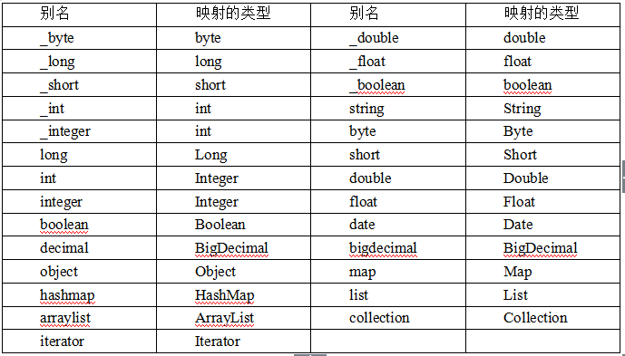

# 复习第一个MyBatis程序：
1. mybatis.jar   ojdbc.jar  
2. conf.xml (数据库配置信息、映射文件)  
3. 表-类：映射文件  mapper.xml  
4. 测试

# 一、基础方式的增删改查CRUD:
> mybatis约定：  
输入参数parameterType 和 输出参数resultType ，在形式上都只能有一个

> 如果输入参数 ：是简单类型（8个基本类型+String） 是可以使用任何占位符,#{xxxx}  
如果是对象类型，则必须是对象的属性 #{属性名}

> 输出参数：  如果返回值类型是一个 对象（如Student），则无论返回一个、还是多个，
再resultType都写成org.lanqiao.entity.Student
即 resultType="org.lanqiao.entity.Student"

## 注意事项：
> a. 如果使用的 事务方式为 jdbc,则需要 手工commit提交，即session.commit();  
b.所有的标签 \<select> \<update>等 ，都必须有sql语句，但是sql参数值可选  
select* from student  where stuno = #{xx}  
sql有参数：session.insert(statement, 参数值 );  
sql没参数：session.insert(statement);

# 二、mapper动态代理方式的crud （MyBatis接口开发）:
### 原则：约定优于配置

## 硬编码方式
`abc.java  
Configuration conf = new Configuration();  
con.setName("myProject");`
## 配置方式：
`abc.xml  
\<name>myProject\</name>`

### 约定：默认值就是myProject

## 具体实现的步骤：
> 1.基础环境：mybatis.jar/ojdbc.jar、conf.xml、mapper.xml  
2.（不同之处）  
约定的目标： 省略掉statement,即根据约定 直接可以定位出SQL语句

>a.接口，接口中的方法必须遵循以下约定:  
1.方法名和mapper.xml文件中标签的id值相同
2.方法的 输入参数 和mapper.xml文件中标签的 parameterType类型一致 (如果mapper.xml的标签中没有 parameterType，则说明方法没有输入参数)  
3.方法的返回值  和mapper.xml文件中标签的 resultType类型一致 （无论查询结果是一个 还是多个（student、List<Student>），在mapper.xml标签中的resultType中只写 一个（Student）；如果没有resultType，则说明方法的返回值为void）  

除了以上约定，要实现 接口中的方法  和  Mapper.xml中SQL标签一一对应，还需要以下1点：  
namespace的值 ，就是  接口的全类名（ 接口 - mapper.xml 一一对应映射）

### 匹配的过程：（约定的过程）
1. 根据 接口名 找到 mapper.xml文件（根据的是namespace=接口全类名）  
2. 根据 接口的方法名 找到 mapper.xml文件中的SQL标签 （方法名=SQL标签Id值）

以上2点可以保证： 当我们调用接口中的方法时，
程序能自动定位到 某一个Mapper.xml文件中的sqL标签

> 习惯：SQL映射文件（mapper.xml） 和 接口放在同一个包中 （注意修改conf.xml中加载mapper.xml文件的路径）  
补充：  
SQL映射文件（mapper.xml） 和 接口放在同一个包中，还需要pom.xml中<build>标签添加：(不然找不到映射文件)

    <!--  在pom文件 标明xml的位置  -->
    <resources>
      <resource>
        <directory>src/main/java</directory>  
        <includes>  
          <include>**/*.xml</include>  
        </includes>  
        <filtering>true</filtering>  
      </resource>  
    </resources>  `

以上，可以通过接口的方法->SQL语句

执行：  
`StudentMapper studentMapper = session.getMapper(StudentMapper.class);
studentMapper.方法(); `

通过session对象获取接口（session.getMapper(接口.class);），再调用该接口中的方法，程序会自动执行该方法对应的SQL。  

网上资料补充：https://www.cnblogs.com/zjdxr-up/p/8681382.html

## 优化
### 1.可以将配置信息 单独放入 db.properties文件中，然后再动态引入

db.properties：  
k=v

    <configuration>
	    <properties  resource="db.properties"/>
引入之后，使用${key}

### 2.MyBatis全局参数
    在conf.xml中设置

    <!--   
    <settings>  
            <setting name="cacheEnabled" value="false"  />  
            <setting name="lazyLoadingEnabled" value="false"  />  
    </settings>  
     -->
>mybatis全局参数

| 参数 | 简介 | 有效值 |
| :-----| ----: | :----: |
| cacheEnabled|	在全局范围内，启用或禁用缓存	|true（默认）、false|
| lazyLoadingEnabled|在全局范围内启用或禁用延迟加载。当禁用时，所有相关联的对象都将立即加载（热加载）。|true（默认）、false|
| aggressiveLazyLoading|启用时，有延迟加载属性的对象，在被调用时将会完全加载所有属性（立即加载）。否则，每一个属性都将按需加载（即延迟加载）。|true（默认）、false|
| multipleResultSetsEnabled|允许或禁止执行一条单独的SQL语句后返回多条结果（结果集）；需要驱动程序的支持|true（默认）、false|
| autoMappingBehavior	|指定数据表字段和对象属性的映射方式。 NONE：禁止自动映射，只允许手工配置的映射 |PARTIAL：只会自动映射简单的、没有嵌套的结果 FULL：自动映射任何结果（包含嵌套等）	NONE、 PARTIAL（默认）、 FULL
| defaultExecutorType	指定默认的执行器。SIMPLE：普通的执行器。REUSE：可以重复使用prepared statements语句。BATCH：可以重复执行语句和批量更新。	|SIMPLE（默认）、REUSE、BATCH|
| defaultStatementTimeout	|设置驱动器等待数据库回应的最长时间	|以秒为单位的，任意正整数。无默认值
| safeRowBoundsEnabled	|允许或禁止使用嵌套的语句	|true、false（默认）|
| mapUnderscoreToCamelCase	|当在数据表中遇到有下划线的字段时，自动映射到相应驼峰式形式的Java属性名。例如，会自动将数据表中的stu_no字段，映射到POJO类的stuNo属性。	|true、false（默认）
| lazyLoadTriggerMethods	|指定触发延迟加载的对象的方法	|equals、clone、hashCode、toString|

### 3.别名 conf.xml
    a.设置单个别名  
    b.批量设置别名
	<typeAliases>  
		<!-- 单个别名 （别名 忽略大小写） -->  
		<!-- <typeAlias type="org.lanqiao.entity.Student" alias="student"/> -->  
		<!--  批量定义别名  （别名 忽略大小写），以下会自动将该包中的所有类 批量定义别名： 别名就是类名（不带包名，忽略大小写）   -->  
		<package name="org.lanqiao.entity"/>  
	</typeAliases>  

除了自定义别名外，MyBatis还内置了一些常见类的别名（mybatis给一些java类取的别名！）。

## 类型处理器（类型转换器）
### 1.MyBatis自带一些常见的类型处理器
    int（java）  - number(jdbc)

>Mybatis内置的类型处理器如表所示

|类型处理器|	Java类型|	JDBC类型|
| :-----| ----: | :----: |
|BooleanTypeHandler| 	Boolean，boolean |	任何兼容的布尔值|
|ByteTypeHandler| 	Byte，byte 	|任何兼容的数字或字节类型|
|ShortTypeHandler |	Short，short 	|任何兼容的数字或短整型|
|IntegerTypeHandler| 	Integer，int |	任何兼容的数字和整型|
|LongTypeHandler 	|Long，long |	任何兼容的数字或长整型|
|FloatTypeHandler |	Float，float |	任何兼容的数字或单精度浮点型|
|DoubleTypeHandler |	Double，double 	|任何兼容的数字或双精度浮点型|
|BigDecimalTypeHandler|	BigDecimal |	任何兼容的数字或十进制小数类型|
|StringTypeHandler 	|String 	|CHAR和VARCHAR类型|
|ClobTypeHandler 	|String 	|CLOB和LONGVARCHAR类型|
|NStringTypeHandler |	String |	NVARCHAR和NCHAR类型|
|NClobTypeHandler 	|String 	|NCLOB类型|
|ByteArrayTypeHandler| 	byte[] 	|任何兼容的字节流类型|
|BlobTypeHandler |	byte[] 	|BLOB和LONGVARBINARY类型|
|DateTypeHandler |	Date（java.util）	|TIMESTAMP类型|
|DateOnlyTypeHandler |	Date（java.util）	|DATE类型|
|TimeOnlyTypeHandler |	Date（java.util）	|TIME类型
|SqlTimestampTypeHandler| 	Timestamp（java.sql）	|TIMESTAMP类型|
|SqlDateTypeHandler| 	Date（java.sql）	|DATE类型|
|SqlTimeTypeHandler |	Time（java.sql）	|TIME类型|
|ObjectTypeHandler| 	任意	其他或未指定类型|
|EnumTypeHandler| 	Enumeration类型	|VARCHAR。任何兼容的字符串类型，作为代码存储（而不是索引）。|

### 2.自定义MyBatis类型处理器
	java -数据库(jdbc类型)  
示例：  
>实体类Student :  boolean   stuSex  	  
true:男  
false：女  

>表student：	number  stuSex  
1:男  
0：女  
自定义类型转换器（boolean -number）步骤：   
a.创建转换器：需要实现TypeHandler接口  
通过阅读源码发现，此接口有一个实现类 BaseTypeHandler ，因此 要实现转换器有2种选择：  
i.实现接口TypeHandler接口  
ii.继承BaseTypeHandler  
b.配置conf.xml  

需要注意的问题：  INTEGER  

    insert into student(stuno,stuname,stuage,graname,stusex) values(#{stuNo},#{stuName},#{stuAge},#{graName} ,#{stuSex ,javaType=boolean  ,jdbcType=INTEGER   } )  

注意#{stuNo} 中存放的是 属性值，需要严格区分大小写。  

##resultMap可以实现2个功能：
1.类型转换  
2.属性-字段的映射关系

    <select id="queryStudentByStuno" 	parameterType="int"  	resultMap="studentMapping" >  
            select * from student where stuno = #{stuno}  
        </select>
        <resultMap type="student" id="studentMapping">  
                <!-- 分为主键id 和非主键 result-->  
                <id property="id"  column="stuno"  />  
                <result property="stuName"  column="stuname" />  
                <result property="stuAge"  column="stuage" />  
                <result property="graName"  column="graname" />  
                <result property="stuSex"  column="stusex"  javaType="boolean" jdbcType="INTEGER"/>
        </resultMap>

	
	