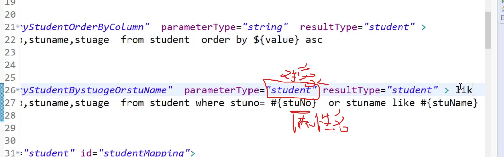

# 输入参数：parameterType
1. (接口传入值)类型为 简单类型（8个基本类型+String）  
## \#{}、\${}的区别：  
- a.
    \#{任意值}
    \${value} ，其中的标识符只能是value
- b.
    \#{}自动给String类型加上''  （自动类型转换）
    \${} 原样输出，但是适合于 动态排序（动态字段）

`select stuno,stuname,stuage  from student where stuname = #{value}`

`select stuno,stuname,stuage  from student where stuname = '${value}'`

动态排序：  
`select stuno,stuname,stuage  from student  order by ${value} asc
`

- c.\#{}可以防止SQL注入  
\${}不防止

## \${}、\#{}相同之处：
- a.都可以 获取对象的值 （嵌套类型对象）

## i.获取对象值：
- 模糊查询，方式一：
select stuno,stuname,stuage  from student where stuage= #{stuAge}  or stuname like #{stuName}
Student student = new Student();
student.setStuAge(24);
student.setStuName("%w%");  
List\<Student\> students = studentMapper.queryStudentBystuageOrstuName(student) ;//接口的方法->SQL

- 模糊查询，方式二：
student.setStuName("w");
select stuno,stuname,stuage  from student where stuage= #{stuAge}  or stuname like '%${stuName}%'

## ii.嵌套类型对象

2. (接口传入值)对象类型
\#{属性名}
\${属性名}  

# 输入对象为HashMap：
`where stuage= #{stuAge}`

用map中key的值 匹配 占位符#{stuAge}，如果匹配成功 就用map的value替换占位符

