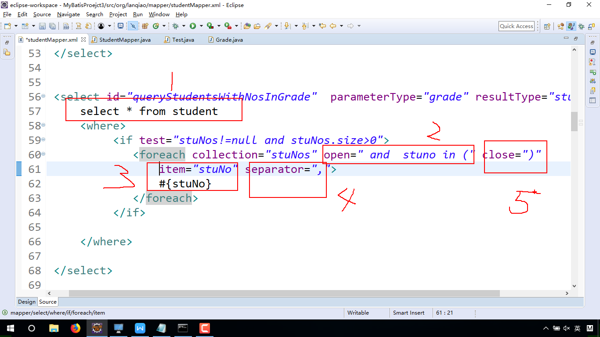

- 查询全部
String statement = "select stuno,stuname from student";

- 根据年龄查询学生
String statement = "select stuno,stuname from student where stuage = #{stuage}";

- 根据姓名和年龄查询学生
String statement = "select stuno,stuname from student where stuage = #{stuage} and stuage = #{stuage} ";
select stuno,stuname from student where  stuname = #{stuName}and  stuage = #{stuAge}

## \<if>
>select stuno,stuname,stuage from student <where> and stuname = #{stuName}  and  stuage = #{stuAge}

第一部分: select stuno,stuname from student where  
第二部分: stuname = #{stuName}  
第三部分: and  stuage = #{stuAge}  
通过&#60;if>拼接、复用
### \<where>  
>&#60;where>会自动处理第一个<if>标签中的 and，但不会处理之后<if>中的and

## \<foreach>
查询学号为1、2、53的学生信息 

ids = {1,2,53};

select stuno,stuname from student  where stuno in(1,2,53)

<foreach>迭代的类型：数组、对象数组、集合、属性(Grade类： 属性：List<Integer> ids)

- 属性(Grade类： List<Integer> ids)

select * from student
open:
select * from student and  stuno in (
item:
select * from student and  stuno in (1253
close:
select * from student and  stuno in (1,2,53)  

- 简单类型的数组:
无论编写代码时，传递的是什么参数名(stuNos)，在mapper.xml中 必须用array代替该数组（约定）

- 集合：
无论编写代码时，传递的是什么参数名(stuNos)，在mapper.xml中 必须用list代替该数组（约定）

- 对象数组：  
Student[] students = {student0,student1,student2} 每个studentx包含一个学号属性  
注意的几点：  
parameterType="Object[]"  
\<foreach collection="array" open=" and  stuno in (" close=")"  item="student" separator=",">   
\#{student.stuNo}  
\</foreach>

## SQL片段：  
java：方法  
数据库：存储过程、存储函数  
Mybatis :SQL片段  

- a.提取相似代码
- b.引用

### 关联查询：
一对一:  
- a.业务扩展类  
核心：用resultType指定类的属性 包含 多表查询的所有字段

- b.resultMap

#### 一对多
（MyBatis:多对一，多对多的本质就是  一对多的变化）

 

