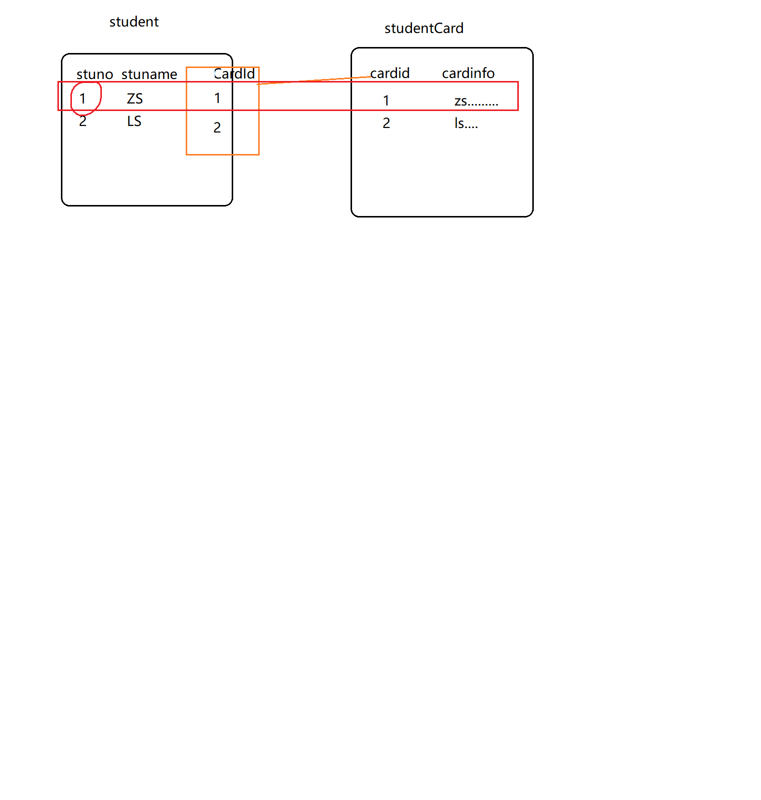

# 关联查询：
## 一对一

- a.业务扩展类  

核心：用resultType指定(扩展)类的属性 包含 多表查询的所有字段
- b.resultMap

## 一对多
（MyBatis:多对一，多对多的本质就是  一对多的变化）

- 表：student studentclass(关联：classid？)
- 类：Student StudentClass（关联：List<Student> students）
